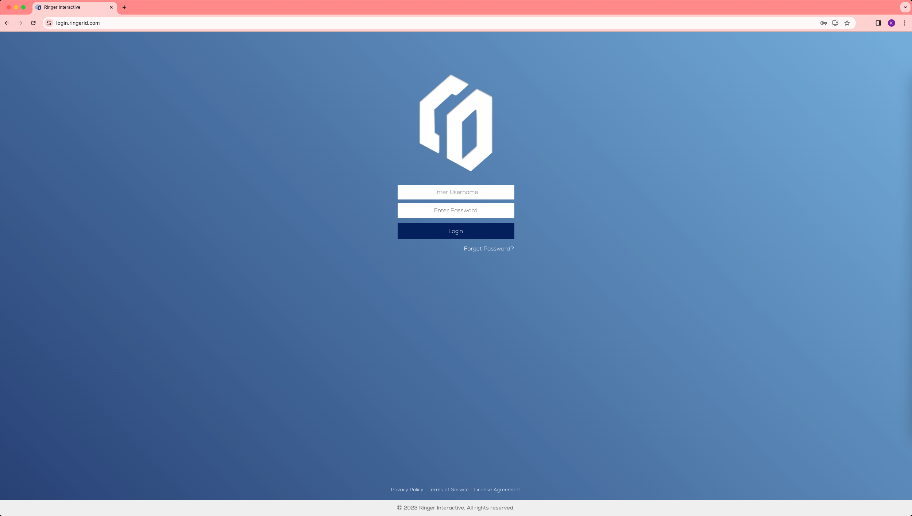
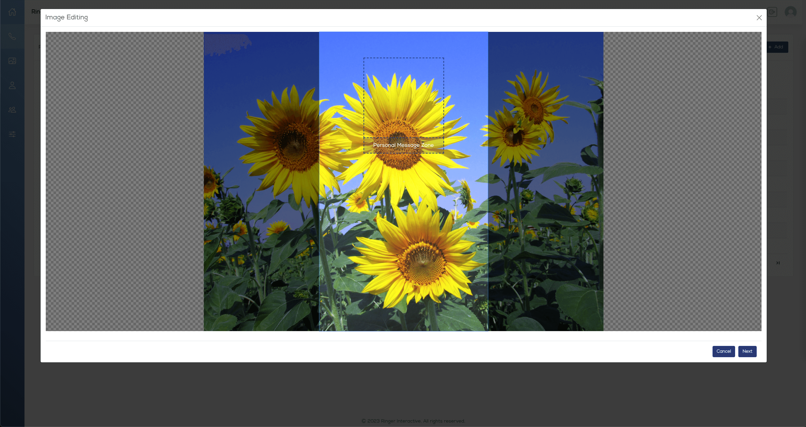
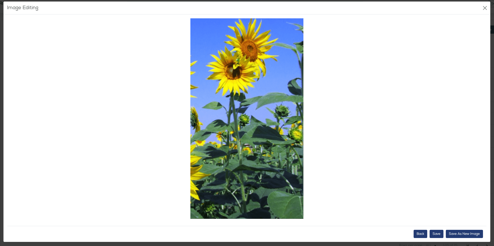
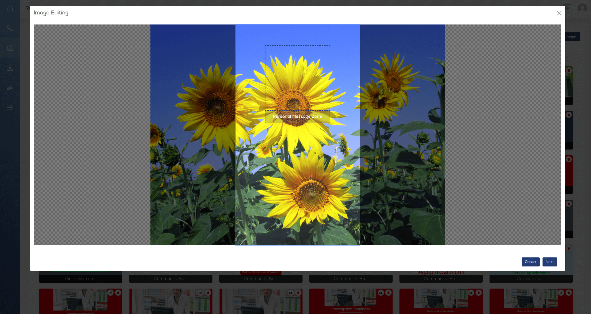
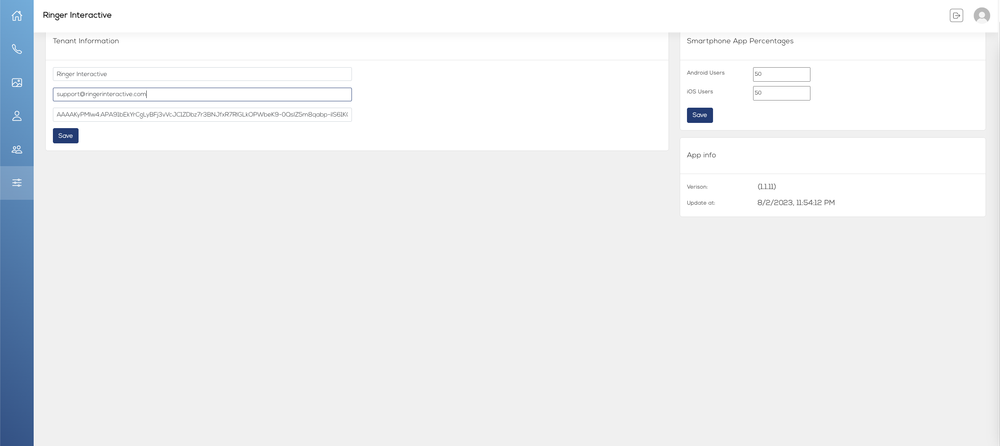

# Admin Portal Guide

Web Admin Console Guide
December 2023

Full-Screen Branded Calling Ensures 
Customers Never Miss Your Call.

Ringer transforms the phone screenß
into a personalized, actionable
message customers won’t ignore, 
silence or send to voicemail.

:::tip FOR INTERNAL USE
#### This document is intended for approved team members of clients of Ringer Interactive. This guide is provided in order for the appropriate end users to familiarize themselves with and refer back to when using the Ringer Interactive Web Admin Console in conjunction with the Ringer SDK integrated into the client’s mobile application.
:::
:::tip DISCLAIMER 
#### This document should not be distributed to any third parties or used (in whole or in part) for any other system without the explicit consent of Ringer Interactive.
:::

:::tip Please Note:
You will need to have the Software Development Kit (SDK) incorporated into your existing mobile applications in order to add the ability to push contacts into your end users’ mobile devices, including images, contact information, and contact phone number(s). Please work with your Ringer Account Manager during this process. 
:::
Apple iOS SDK = https://github.com/RingerInteractive/Ringer-Interactive-iOS
Android SDK = https://github.com/RingerInteractive/Ringer-SDK-Sample-App

### Login

You can simply visit https://login.ringerid.com/ and use the username and password provided to you by your Ringer Client Services representative. 

 

If you have forgotten your password, simply use the link below the login button and enter your email. If your email address is on file in the system, we will automatically send you an email with a link to reset your password.

 If you have any additional questions, please email support@ringerinteractive.com. 

### Dashboard (Call Analytics)
Once logged in, you will be taken to the main dashboard, where you can view call analytics.

 

The chart displays calls over the given time period, and defaults to the current month. You can change the date range and filter by phone numbers you have assigned within the system.

 

On the right side you can view the call Answer Rates. 

 

:::tip Please note:
A successful call is defined as a call answered and lasting longer than 15 seconds.
Due to limitations by Apple, the system tracks Android calls only, and calculates estimated iOS calls based on a percentage setting you choose from the Settings page (please see the Settings in the guide). The default ratio is set to 50/50. You can update this at any time.
:::

### Contacts
Selecting the phone icon from the left menu will take you to the Contacts page. To add a new phone number for your company click on the “+Add” button at the top right. 

 

You will be taken to the page to enter all of the details for the contact phone number. You can include multiple numbers if you prefer, and also set regions for the contact (these options can always be edited at a later time as well). 
Please complete the form then click on “Upload Image” to set an image for the contact.

You then are given the option to select an image from your own system or from the gallery of images already uploaded to the platform.

 

The next three (3) steps allow you to 
reposition your image, 
add a text or graphic overlay, and then 
preview and save the image. 

 

You can use this internal editor, however for the best possible image output, we recommend following the Image Preparation steps:
Make sure you size any images to be used to 240pixel X 510pixels.

 

Use the template Photoshop document (.PSD file) provided by your account manager.
When placing your own imagery and text within an image, please note the “Sweet Spot” folder layers within the .PSD file, where you can see the best area for an image and also where text and buttons will be overlaid by iOS and Android devices in the top and bottom of the device screen. The open area is the best for any text or graphic you wish to highlight within any full image.

“Sweet Spot” folder layers ON

Make sure to hide the “Sweet Spot” folder layers before exporting your final image.
“Sweet Spot” folder layers OFF

After your image preparation is complete, simply upload it and then do not make adjustments with the Internal Editor (Steps 1-3).

Internal Editor Step 1: The system defaults your image to the best position, however you can change it if you prefer. Simply click Next to move to the next step.

 

Internal Editor Step 2: Next you can add text or graphic overlays. This is optional and not required. Click the checkmark at the top right when complete.

 

Internal Editor Step 3: Finally, you will see a preview of the image. Click Save to move to the next step.

 

You will be taken back to the Add Contact screen where you can preview how the image and contact information will appear on both iOS and Android phones. You can toggle between the 2 different iOS states and between iOS and Android using the icons above the phone preview image. Click Add to finish adding the contact.

iOS 1

 

iOS 2

 

Android

 

### Image Gallery

Selecting the picture icon from the left menu will take you to the Image Gallery page. Here you can view all previously uploaded images, and even upload new images should you wish to build a library of images without necessarily adding them to a contact and phone number immediately.

 

You can toggle between an icon view and list view of all images within your Gallery.

 

Click the “Upload Image” button from the top right. You will be prompted to provide a name for the image and given the option to select an existing contact or contacts. Note - while selecting an existing contact is not required, this feature can be used to assign the image to multiple contacts (phone numbers) in one step.

 

Once you have done this, click on Upload Image and then “Select from System” or “Select from Gallery” to add your new image to your Gallery. 

 

You will be taken through the same three (3) steps of the image editing process shown in the “Contacts” of this guide.

 

Finally you will be able to preview how the image will look on iOS and Android phones. Click on Save to move to the next step.

iOS 1

 

iOS 2

 

Android

 

Finally you can click the “Add” button to save your image to your Gallery.

 

###  Profile
Selecting the single person icon from the left menu or the icon in the top right of the screen will take you to the Profile page. Here you can modify and set your Image, Name, Phone Number, Email Address, and Password to access the system.

 

### Users
Selecting the dual person icon from the left menu will take you to the Users page. As an admin, from here you can view and modify all of your existing users within your company who have access to this platform, and add new users as needed. Please Note: Only users with admin access can access this page.

 

Click on the “+ Add” button in the top right to add a new user. Complete the form and click the “Add” button to finish adding your new user.

 

To edit an existing user, click on the edit icon in the row for that user. Complete the form and click the “Save” button to finish editing the user.

 

:::tip Please Note: 
There are two types of users for the system - 
Admins: Admins have full access to all functionality and settings within the web admin platform. 
Managers: Managers have access to the Dashboard, Contacts, Image Gallery, and their own Profile. They do not have access to other users or the Settings section.

:::

### Settings
Selecting the controls icon from the left menu will take you to the Settings page. As an admin, from here you can view and modify your Company Name, Main Contact Email Address, Firebase token (used to send notifications to mobile devices) and optionally add a company number. 

 

:::tip Please Note: 
Only users with admin access can access this page.
For more information on Firebase tokens, please see the provided document titled “Ringer Interactive - Firebase Account Creation Instructions”, https://support.google.com/appsheet/answer/10104995, and https://firebase.google.com/. You will need a Google account prior to going through this process.
You can view and edit the Smartphone App Percentages (referenced earlier in the  Dashboard (Call Analytics) in this guide).
:::

Questions? 

 If you have any additional questions, please email support@ringerinteractive.com. 

Thank you!

