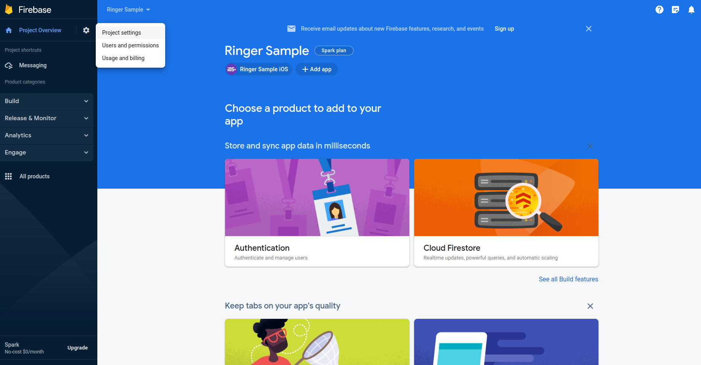
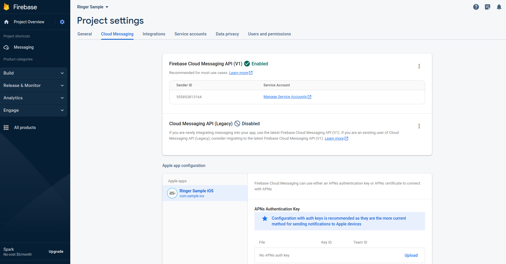
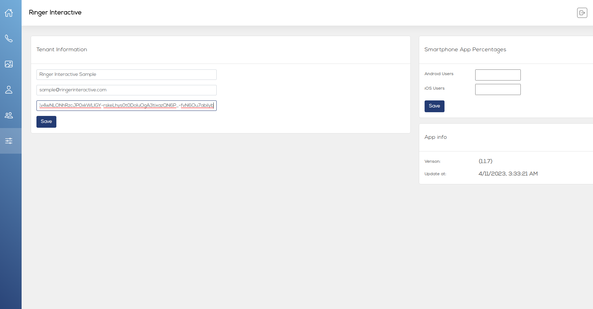

# Adding Firebase server key

1. Visit https://console.firebase.google.com/ and log in with your associated
 Google account. Go to Project Settings

2. Select the 'Cloud Messaging' tab and you will see the server key token. Copy that value

2. Login to Ringer Portal, go to Settings. Paste the copied Firebase token into the appropraite field and click Save.

